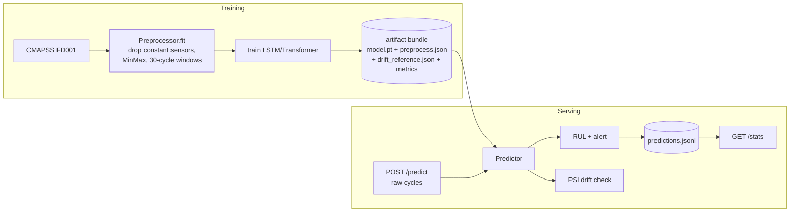

# RUL Predictive Maintenance Service

**A deployable, monitored Remaining-Useful-Life (RUL) prediction service for
turbofan engines (NASA CMAPSS FD001).**

This turns a research notebook ([transformer-vs-lstm-on-time-series](https://github.com/cla5hr/transformer-vs-lstm-on-time-series))
into the thing industry actually runs: a **REST API** that predicts how many cycles
an engine has left, raises **maintenance alerts**, and **monitors for data drift** —
packaged with Docker and CI.

> Predicting RUL in a notebook answers *"can a model do this?"*. This project answers
> the harder question: *"can you ship and operate it?"*

---

## What it does

```
POST /predict   { "engine_id": "42", "cycles": [ {sensor readings per cycle...} ] }
      │
      ▼
{ "rul": 23.7, "status": "warning", "model_type": "lstm",
  "drift": { "status": "ok", "max_psi": 0.04 } }
```

- **RUL prediction** from an engine's recent raw sensor history (the LSTM from the
  notebook, reproduced at **Test RMSE 15.65 / MAE 11.80**).
- **Maintenance alerts**: `healthy` / `warning` / `critical` from configurable RUL
  thresholds.
- **Data-drift monitoring** (PSI): flags when live sensor distributions move away
  from training — with a minimum-sample guard so single-window requests don't false
  alarm.
- **Monitoring endpoint** (`/stats`) summarising logged predictions.
- **Fleet dashboard**, **Docker/compose**, and **GitHub Actions CI**.

---

## Architecture



The **artifact bundle** is the contract between training and serving: the exact
feature columns, scale parameters, sequence length, and drift reference learned at
training time are persisted, so inference replays an identical transform.

---

## Quickstart

```bash
git clone https://github.com/cla5hr/rul-prediction.git
cd rul-prediction
python -m venv .venv && source .venv/bin/activate
pip install -e ".[ui,dev]"        # or: pip install -r requirements.txt
```

A pre-trained model ships in `artifacts/`, so you can serve immediately. To retrain:

```bash
rul-service train --model lstm --epochs 50     # writes artifacts/
rul-service evaluate                            # show stored metrics
```

### Serve the API
```bash
rul-service serve                  # http://127.0.0.1:8000/docs
```

Make a request from a real test engine:
```bash
rul-service sample --engine-index 0 --out engine.json
curl -s -X POST http://127.0.0.1:8000/predict -H 'Content-Type: application/json' -d @engine.json
```

### Dashboard
```bash
streamlit run app/dashboard.py     # fleet overview, per-engine view, drift monitor
```

### Docker
```bash
docker compose up --build          # API on :8000, dashboard on :8501
```

---

## API

| Method | Path | Purpose |
|--------|------|---------|
| GET | `/health` | liveness + whether a model is loaded |
| GET | `/model/info` | architecture, metrics, feature columns, thresholds |
| POST | `/predict` | RUL + alert + drift for one engine |
| POST | `/predict/batch` | many engines + fleet-level drift |
| GET | `/stats` | summary of logged predictions (monitoring) |

Request body for `/predict`:
```json
{
  "engine_id": "42",
  "cycles": [
    {"op1": -0.0007, "op2": -0.0004, "s2": 641.82, "s3": 1589.70, "...": 0.0}
  ]
}
```
Only the model's feature columns are used; missing columns default to 0. The last
30 cycles form the prediction window (front-padded if fewer).

---

## How it maps to the original notebook

| Notebook step | Here |
|---------------|------|
| Drop near-constant sensors + `op3` | `Preprocessor.fit` (variance filter) |
| Clip RUL at 125, MinMax scale | `add_training_rul`, `Preprocessor.scale_array` |
| 30-cycle sliding windows | `Preprocessor.make_train_sequences` |
| LSTM / Transformer (from scratch) | `rul_service/models.py` (verbatim) |
| Train 50 epochs, Adam + StepLR | `rul_service/train.py` |
| Evaluate on FD001 test set | `train.evaluate` → `metrics.json` |

Reproduced result (LSTM): **RMSE 15.65, MAE 11.80** (notebook reported 15.50 / 11.80).

---

## Configuration (env vars)

| Variable | Default | Purpose |
|----------|---------|---------|
| `RUL_MODEL` | `lstm` | `lstm` or `transformer` |
| `RUL_EPOCHS` | `50` | training epochs |
| `RUL_CRITICAL` / `RUL_WARNING` | `20` / `50` | alert thresholds (cycles) |
| `RUL_PSI_WARN` / `RUL_PSI_ALERT` | `0.1` / `0.25` | drift thresholds |
| `RUL_ARTIFACTS_DIR` | `artifacts/` | model bundle location |

---

## Tests

```bash
pytest -q
```

Covers preprocessing, PSI drift (no-drift / drift / insufficient-sample), the
predictor, and the API (via a tiny model trained on the fly). CI also runs a
1-epoch smoke train + predict.

## Notes on drift

The FD001 **test** set is truncated before failure, so it is genuinely *healthier*
than the run-to-failure **training** set — a real, expected distribution shift the
PSI monitor will surface at fleet level. The dashboard's "inject offset" slider lets
you simulate a miscalibrated sensor and watch PSI climb past the alert line.
